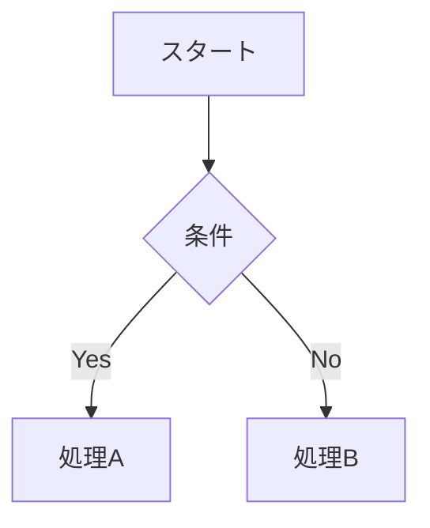

# Slidev - LLM 向け統合ドキュメント

このドキュメントは、LLM（大規模言語モデル）がSlidevについて理解しやすいよう、公式ドキュメントの内容を1つのファイルにまとめたものです。

## Slidev の概要

**Slidev** (**slide + dev**, `/slaɪdɪv/`) は、Web ベースのスライド作成・プレゼンテーションツールです。開発者が Markdown でのコンテンツ作成に集中できるよう設計されています。Vue などの Web 技術の力により、インタラクティブなデモを含む、ピクセル完璧なデザインのプレゼンテーションを提供できます。

### なぜ Slidev なのか

既存の WYSIWYG スライド作成ツール（PowerPoint、Keynote）と比較して、Slidev は以下の特徴を持ちます：

- **開発者フレンドリー**: 慣れ親しんだ技術で作成可能
- **Markdown ベース**: コンテンツに集中でき、Git でバージョン管理可能
- **Web ベース**: Web アプリでできることはすべて適用可能
- **ハッカブル**: Web 技術で自由にカスタマイズ可能
- **オープンソース**: 強力なコミュニティサポート
- **プログレッシブ**: シンプルから始めて必要に応じて機能を追加

## 主要な機能

### 📝 Markdown ベース

- 拡張 Markdown 形式を使用してスライドを組織化
- 単一のプレーンテキストファイルでプレゼンテーション全体を管理
- Git や好みのエディターを使用可能

### 🧑‍💻 開発者フレンドリー

- [Shiki](https://github.com/shikijs/shiki) による正確なシンタックスハイライト
- Shiki Magic Move とTwoslash のサポート
- ライブコーディング機能
- オートコンプリートとホバーメッセージ

### 🎨 テーマ対応

- npm パッケージでテーマを共有
- 1行のコードでテーマを適用
- 豊富なテーマギャラリー

### ⚡ 高速

- Vite の HMR（Hot Module Replacement）による即座の更新
- リロード不要での変更反映

### 🤹 インタラクティブ & 表現力豊か

- Vue コンポーネントをスライド内で使用可能
- プレゼンテーション中のインタラクション
- Monaco Editor の組み込みサポート

### 🎥 録画サポート

- 組み込みの録画とカメラビュー機能
- 画面とカメラを別々に録画・保存可能

### 📤 ポータブル

- PDF、PPTX、PNG、SPA への単一コマンドエクスポート
- どこでも共有・ホスティング可能

### 🛠 ハッカブル

- WebGL、API リクエスト、iframe、ライブ共有などが可能
- Vite プラグイン、Vue コンポーネント、npm パッケージを自由に使用

## インストールと基本使用法

### 前提条件

- Node.js >= 18.0

### プロジェクト作成

```bash
# pnpm (推奨)
pnpm create slidev

# npm
npm init slidev@latest

# yarn
yarn create slidev

# bun
bun create slidev

# deno
deno init --npm slidev
```

### 基本コマンド

```bash
# 開発サーバー起動
slidev

# PDF/PPTX/PNG エクスポート
slidev export

# 静的 Web アプリとしてビルド
slidev build

# スライドフォーマット
slidev format

# ヘルプ
slidev --help
```

### package.json 設定例

```json
{
  "scripts": {
    "dev": "slidev --open",
    "build": "slidev build",
    "export": "slidev export"
  }
}
```

## Markdown 構文

### スライド区切り

```markdown
# スライド1

Hello, **Slidev**!

---

# スライド2

コンテンツ

---

# スライド3

さらなるコンテンツ
```

### Frontmatter & Headmatter

```markdown
---
# ヘッドマター（最初のスライド）
theme: seriph
title: プレゼンテーションタイトル
---

# スライド1

---

layout: center
background: /background.png

---

# スライド2
```

### ノート

```markdown
# スライドタイトル

スライドコンテンツ

<!-- これは発表者ノートです -->
```

### コードブロック

````markdown
```typescript
interface User {
  name: string;
  age: number;
}

const user: User = {
  name: 'Alice',
  age: 25,
};
```
````

### LaTeX

```markdown
$$
f(x) = \int_{-\infty}^{\infty} \hat{f}(\xi) e^{2 \pi i \xi x} d\xi
$$
```

### 図表（Mermaid）

````markdown

````

### MDC Syntax

```markdown
# タイトル {style="color: red"}

::div{class="custom-class"}
カスタムコンテンツ
::
```

### スコープ付き CSS

```markdown
# スライドタイトル

<style>
h1 {
  color: #42b883;
}
</style>
```

### クリックアニメーション（v-click）

Slidev では `v-click` ディレクティブを使用して、要素をクリックごとに順番に表示できます。これはプレゼンテーション中の段階的な情報開示に非常に有用です。

#### 基本的な使い方

```markdown
# スライドタイトル

<div v-click>

最初のクリックで表示される内容

</div>

<div v-click>

2回目のクリックで表示される内容

</div>

<div v-click>

3回目のクリックで表示される内容

</div>
```

#### インライン要素への適用

```markdown
# スライドタイトル

通常のテキスト <span v-click>クリックで表示される部分</span> 続きのテキスト
```

#### リスト項目への適用

```markdown
# TODO リスト

- <div v-click>タスク1: 設計書作成</div>
- <div v-click>タスク2: 実装</div>
- <div v-click>タスク3: テスト</div>
- <div v-click>タスク4: デプロイ</div>
```

#### 番号指定での順序制御

```markdown
# 順序指定

<div v-click="3">3番目に表示</div>
<div v-click="1">最初に表示</div>
<div v-click="2">2番目に表示</div>
```

#### クリック後の動作（v-after）

```markdown
# クリック後の表示

<div v-click>

クリックで表示される内容

</div>

<div v-after>

上記がクリックされた後に自動的に表示される内容

</div>
```

#### v-clicks（複数要素の一括制御）

```markdown
# 一括クリック制御

<v-clicks>

- 項目1
- 項目2
- 項目3
- 項目4

</v-clicks>
```

#### CSS トランジション付き

```markdown
# アニメーション付きクリック

<div v-click class="transform transition-all duration-500 hover:scale-110">

美しいアニメーション付きで表示

</div>

<style>
.slidev-vclick-target {
  transition: opacity 0.3s ease;
}
</style>
```

#### コードブロックでの使用

````markdown
# コード例

<div v-click>

```typescript
interface User {
  name: string;
  age: number;
}
```

</div>

<div v-click>

```typescript
const user: User = {
  name: 'Alice',
  age: 25,
};
```

</div>
````

#### クリック範囲指定

```markdown
# 範囲指定

<v-clicks at="2">

2回目のクリックから開始

</v-clicks>

<v-clicks at="[3, 5]">

3回目から5回目のクリックまでの間のみ表示

</v-clicks>
```

## 設定

### スライドデッキ設定（Headmatter）

```yaml
---
# テーマ
theme: default
# アドオン
addons: []
# タイトル
title: Slidev
titleTemplate: '%s - Slidev'
# 情報
info: false
author: Your Name Here
keywords: keyword1,keyword2

# 機能設定
presenter: true
browserExporter: dev
download: false
exportFilename: slidev-exported
twoslash: true
lineNumbers: false
monaco: true
monacoTypesSource: local
remoteAssets: false
selectable: true
record: dev
contextMenu: true
wakeLock: true
overviewSnapshots: false

# 表示設定
colorSchema: auto
routerMode: history
aspectRatio: 16/9
canvasWidth: 980

# テーマカスタマイズ
themeConfig:
  primary: '#5d8392'

# ファイル設定
favicon: 'https://cdn.jsdelivr.net/gh/slidevjs/slidev/assets/favicon.png'
plantUmlServer: https://www.plantuml.com/plantuml

# フォント
fonts:
  sans: Roboto
  serif: Roboto Slab
  mono: Fira Code

# デフォルト設定
defaults:
  layout: default

# 描画オプション
drawings:
  enabled: true
  persist: false
  presenterOnly: false
  syncAll: true

# HTML 属性
htmlAttrs:
  dir: ltr
  lang: en

# SEO メタタグ
seoMeta:
  ogTitle: Slidev Starter Template
  ogDescription: Presentation slides for developers
  ogImage: https://cover.sli.dev
---
```

### スライドごとの設定（Frontmatter）

```yaml
---
# アニメーション設定
clicks: 0
clicksStart: 0

# 表示設定
disabled: false
hide: false
hideInToc: false

# レイアウト
layout: default
level: 1

# その他
preload: true
routeAlias: undefined
src: undefined
title: undefined
transition: undefined
zoom: 1
dragPos: {}
---
```

## 組み込みレイアウト

- **center**: 画面中央にコンテンツを表示
- **cover**: プレゼンテーションのカバーページ
- **default**: 最も基本的なレイアウト
- **end**: プレゼンテーションの最終ページ
- **fact**: 重要な事実やデータを強調表示
- **full**: 画面全体を使用
- **image-left**: 左側に画像、右側にコンテンツ
- **image-right**: 右側に画像、左側にコンテンツ
- **image**: 画像をメインコンテンツとして表示
- **iframe-left**: 左側に iframe
- **iframe-right**: 右側に iframe
- **iframe**: iframe をメインコンテンツとして表示
- **intro**: イントロダクション用
- **none**: レイアウトなし
- **quote**: 引用表示用
- **section**: セクション区切り
- **statement**: ステートメント表示
- **two-cols**: 2カラムレイアウト

## 組み込みコンポーネント

### 基本コンポーネント

- **Arrow**: 矢印を描画
- **VDragArrow**: ドラッグ可能な矢印
- **AutoFitText**: 自動サイズ調整テキスト
- **LightOrDark**: テーマ別表示

### UI コンポーネント

- **Toc**: 目次
- **TocList**: 目次リスト
- **Link**: リンク
- **RenderWhen**: 条件付きレンダリング
- **SlideCurrentNo**: 現在のスライド番号
- **SlidesTotal**: 総スライド数
- **TitleRenderer**: タイトルレンダラー

### メディアコンポーネント

- **Tweet**: Twitter 埋め込み
- **Youtube**: YouTube 埋め込み
- **Vimeo**: Vimeo 埋め込み
- **VAfter**: アニメーション後表示
- **VClick**: クリック時表示
- **VClicks**: 複数クリック制御

## 機能一覧

### コード関連

- **code-block-line-numbers**: コードブロック行番号
- **code-block-max-height**: コードブロック最大高さ
- **code-groups**: コードグループ
- **line-highlighting**: 行ハイライト
- **monaco-editor**: Monaco エディタ
- **monaco-run**: Monaco 実行
- **monaco-write**: Monaco 記述
- **shiki-magic-move**: Shiki マジックムーブ
- **twoslash**: TypeScript 型情報表示
- **import-snippet**: スニペットインポート

### 表示・デザイン

- **mdc**: MDC シンタックス
- **icons**: アイコン
- **latex**: LaTeX 数式
- **mermaid**: Mermaid 図表
- **plantuml**: PlantUML 図表
- **drawing**: 描画機能
- **rough-marker**: ラフマーカー
- **slide-scope-style**: スコープ付きスタイル
- **global-layers**: グローバルレイヤー

### インタラクション

- **click-marker**: クリックマーカー
- **v-click**: クリックアニメーション（段階的表示）
- **draggable**: ドラッグ可能要素
- **zoom-slide**: スライドズーム
- **direction-variant**: 方向バリエーション

### エクスポート・共有

- **build-with-pdf**: PDF ビルド
- **bundle-remote-assets**: リモートアセットバンドル
- **og-image**: OG イメージ
- **seo-meta**: SEO メタタグ
- **recording**: 録画機能
- **remote-access**: リモートアクセス

### エディタ・開発

- **vscode-extension**: VS Code 拡張
- **side-editor**: サイドエディタ
- **prettier-plugin**: Prettier プラグイン
- **eject-theme**: テーマ取り出し

### 設定・カスタマイズ

- **frontmatter-merging**: フロントマター結合
- **importing-slides**: スライドインポート
- **transform-component**: コンポーネント変換
- **slot-sugar**: スロットシュガー
- **slide-hook**: スライドフック
- **canvas-size**: キャンバスサイズ
- **block-frontmatter**: ブロックフロントマター

## エクスポート

### ブラウザエクスポーター（推奨）

- ナビゲーションバーの「エクスポート」ボタンから利用
- `http://localhost:<port>/export` で直接アクセス
- PDF、PPTX、PNG としてエクスポート可能

### CLI エクスポート

```bash
# PDF エクスポート
slidev export

# PPTX エクスポート
slidev export --format pptx

# PNG エクスポート
slidev export --format png

# Markdown エクスポート
slidev export --format md

# クリックステップ含む
slidev export --with-clicks
```

### 前提条件

```bash
# Playwright のインストール
pnpm add -D playwright-chromium
```

## ホスティング

### 静的サイトとしてビルド

```bash
slidev build
```

### 自動デプロイサービス

- Netlify
- Vercel
- GitHub Pages
- GitLab Pages

## 技術スタック

- **Vite**: 高速フロントエンドツール
- **Vue 3**: JavaScript フレームワーク
- **UnoCSS**: ユーティリティファーストCSS
- **Shiki**: シンタックスハイライター
- **Monaco Editor**: コードエディタ
- **RecordRTC**: 録画機能
- **VueUse**: Vue ユーティリティ
- **Iconify**: アイコンセット
- **Drauu**: 描画サポート
- **KaTeX**: LaTeX レンダリング
- **Mermaid**: 図表作成

## プロジェクト構造

```
slides.md           # メインスライドファイル
package.json        # 依存関係
public/            # 静的ファイル
components/        # カスタムコンポーネント
layouts/          # カスタムレイアウト
styles/           # カスタムスタイル
pages/            # 追加ページ
setup/            # 設定ファイル
vite.config.ts    # Vite 設定
uno.config.ts     # UnoCSS 設定
```

## 開発とカスタマイズ

### カスタムコンポーネント

```vue
<!-- components/MyComponent.vue -->
<template>
  <div class="my-component">
    <slot />
  </div>
</template>
```

### カスタムレイアウト

```vue
<!-- layouts/my-layout.vue -->
<template>
  <div class="my-layout">
    <slot />
  </div>
</template>
```

### テーマ作成

```typescript
// setup/main.ts
import { defineAppSetup } from '@slidev/types';

export default defineAppSetup(({ app, router }) => {
  // アプリ設定
});
```

### プラグイン設定

```typescript
// vite.config.ts
import { defineConfig } from 'vite';

export default defineConfig({
  slidev: {
    // Slidev 設定
  },
});
```

このドキュメントは、LLM が Slidev の機能を理解し、ユーザーのSlidevに関する質問に答えたり、Slidev プロジェクトの作成支援を行うための包括的なリファレンスとして設計されています。
